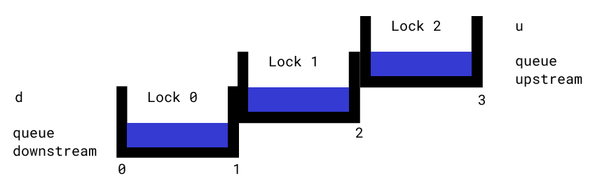

# Canal de Panamá - ALT Version

**Esta consigna es exclusiva para quienes se copiaron en el trabajo original**

## Funcionamiento

Toda esta sección explica el funcionamiento del canal. Pueden probarlo con el simulador, `canal_diagram.py`. A continuación un diagrama de las esclusas que vamos a usar para explicar el software.



### Estado del Canal

El componente principal del sistema de control del canal es el estado. Este es un diccionario que cuentan con toda la información de las esclusas en un determinado momento. El estado inicial del canal es el siguiente:

```python
{
    "locks": ["","",""],
    "locks_water_level": ["low","low","low"],
    "queue_upstream": [],
    "queue_downstream": [],
    "gates": [False,False,False,False],
    "direction": "upstream",
    "control": [],
    "open": True
}
```

¿Pero qué es cada cosa?
- **locks**: Lista de 3 posiciones, una para cada esclusa (0,1,2) como están en el diagrama. Si hay algún barco en la esclusa, aparece su nombre en la posición correspondiente.
- **locks_water_level**: Lista de 3 posiciones, una para cada esclusa (0,1,2) como están en el diagrama. Representan el nivel del agua en dicha esclusa. Hay 4 opciones de nivel, *high*, *low*, *draining*, *filling*.
- **queue_upstream**: Lista. Contiene los barcos esperando para entrar al canal desde el punto más alto, *upstream*, del canal.
- **queue_downstream**: Lista. Contiene los barcos esperando para entrar al canal desde el punto más bajo, *downstream*, del canal.
- **gates**: Lista de 4 posiciones, una para cada compuerta (0,1,2,3). La 0 es entre el punto más bajo del canal y la esclusa 1, la 1 es entre la esclusa 1 y la 2, la 2 es entre la esclusa 2 y la 3, y la 3 es entre la esclusa 3 y el punto más alto del canal. Si la compuerta está abierta, el valor es True, si está cerrada, el valor es False.
- **direction**: Dirección en la que está operando el canal. Puede tomar dos valores, *upstream* y *downstream*.
- **control**: Lista de comandos a ser ejecutados por el control. Se va a explicar más en la fase I.
- **open**: Booleano que dice si está abierto o no el canal. Si el canal está cerrado, los barcos de las filas rio abajo o rio arriba no pueden ingresar al canal.

### Fase I: Ejecutar comandos de control pendientes

Antes, tenemos que entender que es el control, una de las partes principales del estado. El control es una lista de tuplas de la forma `(<tiempo>, <comando>)`, que simulan acciones que llevan tiempo, y el programa debe actualizar el estado del canal cuando dichas acciones se completan. El *tiempo* es simplemente un entero que representa la cuenta regresiva hasta necesitar ejecutar el comando. En la fase I, se ejecutan comandos cuyo tiempo es 0. Al ejecutarlos se eliminan de la lista de control ¿Pero que tipos de comandos hay?
1. **Comando move**: Este tiene la forma de `"move <origen> <destino>"`. Este comando representa la finalización del movimiento de un barco, y al ejecutarse mueve el nombre del barco de `<origen>` a `<destino>` y cierra (`False`) la compuerta entre origen y destino. Por ejemplo, el comando `"move qd 0"` mueve el barco de la fila río abajo, es decir saca el primer elemento de *queue_upstream* (recuerden que el nombre está dado por la dirección a recorrer y no el lugar donde están) y lo pone en la esclusa 0.Además, cierra la compuerta 0.

2. **Comando level**: Este tiene la forma de `"level <esclusa> <nivel>"`. Este comando representa la finalización de un cambio de nivel en una esclusa, y al ejecutarse cambia el nivel de la esclusa referida al nivel deseado. Por ejemplo, el comando `"level 1 high"` setea el nivel de la esclusa 1 en *high*.

3. **Comando direction**: Este tiene la forma de `"direction <abrir> <dirección>"`. Este comando representa el intento de cambio en la dirección del canal. Cuando se ejecuta, primero se chequea si el canal está vacío. Si la respuesta es no, se cierra el canal (`<canal-state>["open"] = False`) a la espera de que los barcos restantes despejen el canal. En este caso, se agrega un comando de 1 minuto para ejecución el próximo ciclo y que vuelva a chequear si el canal está vacío, de la forma `(1,"direction <abrir> <dirección>")`. Si en cambio el canal está vacío, se cambia la dirección a la deseada, y si abrir es igual a "open", se reabre el canal (`<canal-state>["open"] = True`)

### Fase II: Mover barcos a través de las esclusas

Cuando ya hay barcos en las esclusas, hay toda una lógica para ver si un barco puede avanzar de esclusa o salir del canal, o hay que modificar los niveles de las esclusas.

Si la dirección es *upstream*, y el barco se encuentra en una esclusa con nivel bajo (*low*), se debe elevar el nivel del agua en la esclusa en la que está presente. Esto se hace cambiando el nivel de agua a *filling* y agregar el comando de elevar el nivel al control, que dura 10 minutos. El comando entonces sería `(10, level <esclusa> high)`. Para dirección *downstream*, ocurre lo mismo cuando está en una esclusa de nivel alto (*high*). Se debe bajar el nivel del agua, y esto se hace cambiando el nivel a *draining* y agregar el comando de bajar el nivel al control, que sería de la forma `(10, level <esclusa> low)`.

Cuando el barco está listo para pasar a la siguiente esclusa, es decir, en una esclusa de nivel alto (*high*) cuando la dirección es *upstream* o de nivel bajo (*low*) cuando la dirección es *downstream*, se chequean las siguientes cosas:
1. Si hay un barco en la siguiente esclusa, no se hace nada (al menos en términos de este barco, el otro barco puede realizar acciones como subir el nivel de su esclusa).
2. Si el nivel está *draining* o *filling* de la siguiente esclusa, tampoco puede hacer nada.
3. Si el nivel está alto (*high*) en el caso de que la dirección sea *upstream*, debemos bajarlo para que el barco pueda cambiar de esclusa. Esto es setear el nivel de la siguiente esclusa en *draining* y agregar el comando correspondiente, es decir `(10, level <esclusa-a-moverse> low)`. Si el nivel está bajo (*low*) en el caso de que la dirección sea *downstream*, debemos subrilo para que el barco pueda cambiar de esclusa. Esto es setear el nivel de la siguiente esclusa en *filling* y agregar el comando correspondiente, es decir `(10, level <esclusa-a-moverse> high)`.

Si el nivel está alto (*high*) en la esclusa menor, bajo (*low*) en la esclusa superior, y no hay barcos en la esclusa a la que quiere moverse (dependiendo la dirección del canal), el barco **PUEDE** avanzar a la siguiente esclusa. Cuando estas condiciones están dadas, ocurren las siguientes cosas en el estado:
1. Se abre la compuerta correspondiente (`True`) entre la esclusa actual y la esclusa siguiente o salida del canal
2. Se agrega al control el comando para iniciar la salida de esclusa, que dura 2 minutos. Es decir, se agrega de la forma `(2, "move <origen> <destino>")`

En el caso de querer salir del canal, esclusa 0 si es *downstream*, esclusa 2 si es *upstream*, alcanza solo con que el nivel de la esclusa actual sea el correcto: *low* para salir del canal por su extremo río abajo y *high* para salir del canal por su extremo río arriba. Para salir, es simplemente un caso particular de la salida descrita anteriormente. Se abre la compuerta correspondiente, y se agrega el comando de salida al control: `(2, "move 2 u")` cuando la dirección es *upstream*,  `(2, "move 0 d")` cuando la dirección es *downstream*.

Además, los barcos no pueden retroceder, es decir, moverse en una dirección opuesta a la dirección en la que está funcionando el canal actualmente.

### Fase III: Mover barcos al canal desde las filas

Finalmente, el programa ve si hay barcos que quieren entrar al canal. Obviamente, tiene que estar el canal abierto. Si la dirección es *upstream*, debo chequear si hay barcos en la fila, *queue_downstream* (*downstream* porque ingresan desde río abajo). En caso de que haya:
- Si la esclusa 0 está ocupada por un barco no hago nada.
- Si la esclusa 0 está *draining* o *filling* tampoco hago nada.
- Si la esclusa 0 está *high* debo bajar su nivel a *low*. Esto se hace igual que con las esclusas, setear el nivel a *draining* y agregar el comando `(10, level 0 low)`.
- Si la esclusa está *low*, puedo entrar al canal. Esto se hace abriendo la compuerta 0 y agregando el comando correspondiente, `(2, "move qd 0")`.

En el caso de dirección *downstream*, es muy parecido. Si hay barcos en la fila, *queue_upstream* (*upstream* porque ingresan desde río arriba):
- Si la esclusa 2 está ocupada por un barco no hago nada.
- Si la esclusa 2 está *draining* o *filling* tampoco hago nada.
- Si la esclusa 2 está *low* debo subir su nivel a *high*. Esto se hace igual que con las esclusas, setear el nivel a *filling* y agregar el comando `(10, level 2 high)`.
- Si la esclusa está *high*, puedo entrar al canal. Esto se hace abriendo la compuerta 3 y agregando el comando correspondiente, `(2, "move qu 2")`.

## Librerías

Para hacer este tp, se necesitan esencialmente 2 librerías: pytest para los tests, y pygame para los diagramas. Esto se hace con:

```bash
pip install --user pytest
pip install --user pygame
```

## Simulador

Para correr el simulador y ver interactivamente como funciona el canal, deben tener instalada la librería `pygame` y correr el archivo `canal_diagram.py`. ¿Qué es interactivo en el diagrama?
- El reloj, al hacer click avanza un minuto. Un minuto es ejecutar las 3 fases. Primero fase I (ejecutar comandos pendientes), después fase II (barcos dentro de canal) y por último fase III (barcos a la espera en las distintas filas)
- Los `+` suman un barco a la fila del lado en que están.
- Las flechas a ambos lados invierten la dirección del canal.
- El botón `DEBUG` permite ver **parcialmente** el estado, en particular los barcos en las esclusas, los niveles de agua, las compuertas, y el control. Las filas, la dirección y si está abierto o no se ve claramente en pantalla, así que no se incluyó en las características que se ven en el debug.

## Consigna

Construir un conjunto de tests para la función `execute_control` que se encarga de la **fase I** del programa de control. La función `execute_control(canal_state)` toma el estado del canal y ejecuta **todos** los comandos con tiempo 0. Retorna el estado del canal al finalizar la ejecución de la función.

**Los tests deben estar en un archivo aparte.**

Algunos puntos que sus tests deben cumplir:
- Pueden asumir que los comandos siempre siguen la estructura descrita, no tienen que probar comandos inexistentes o comandos "mal armados" (con menos o más parámetros).
- Pueden asumir que los parámetros son correctos, no tienen que probar comandos cuyos parámetros son cosas inválidas.
- Pueden asumir que el estado inicial es válido, es decir, realizable desde la ejecución del programa. No tiene que probar la ejecución de comandos desde estados imposibles.
- Es importante que prueben por separado los casos en donde los parámetros involucran lugares fuera del canal (filas y salidas).
- Es importante que si los comandos implican esclusas, probarlas con y sin barcos.
- Es importante que prueben **todos** los comandos en ambas direcciones del canal.
- Es importante que prueben algún caso de ejecución de múltiples comandos.
- Es importante que prueben algún caso en donde el control tenga comandos que no tengan que ser ejecutados esta ronda.
- Es importante que chequeen todo el estado del canal, independiente de si el comando debería o no afectar esa parte del estado.
- Es importante que los tests se limiten a la función `execute_control`.
- Es importante que los nombres sean descriptivos y apropiados al caso.
- Es importante que los tests tengan lo mínimo indispensable para probar el caso, no debería haber comportamiento accidental.

## Archivos

El tp cuenta con los siguientes archivos:
- carpeta *assets*: contiene todas las imágenes para correr el simulador.
- *canal.py*: Funciones que ejecutan la lógica del canal.
- *canal_diagram.py*: Interfaz gráfica para correr el simulador.

## Evaluación

Como este es un tp para recuperar el contenido de un trabajo práctico que entregaron copiado, su máxima nota posible es 6 (seis). La aprobación de este trabajo se da si:
- Se cumplen todos los puntos descritos en la consigna.
- Los integrantes del grupo **realizan una defensa oral** de su trabajo (a coordinar con el docente).